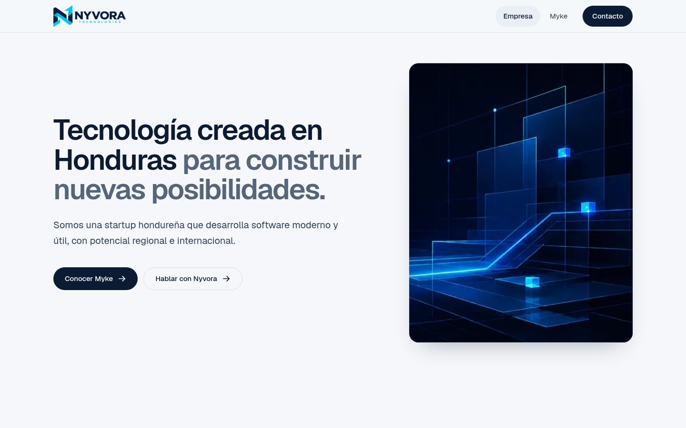
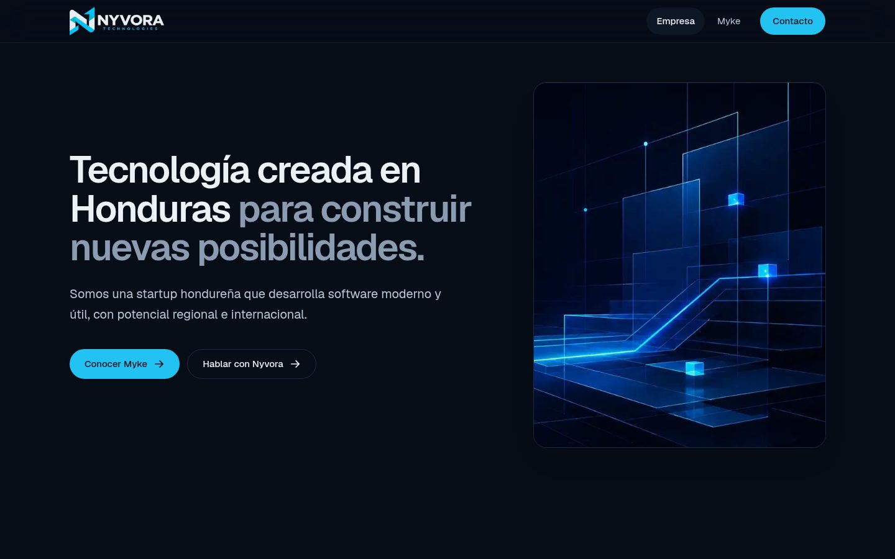
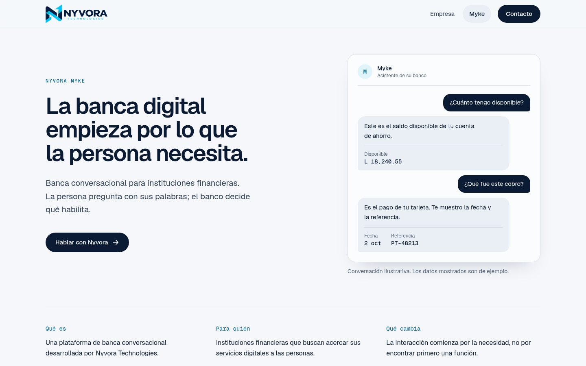
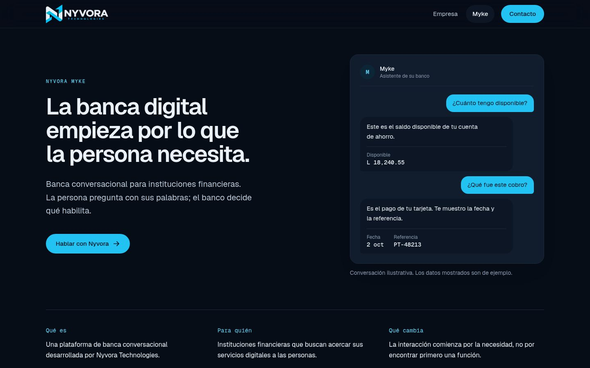

# Nyvora Technologies · Sitio corporativo

Sitio oficial de [Nyvora Technologies](https://nyvoratechnologies.com). Conserva el contenido, las rutas, el SEO, el formulario de contacto seguro y los textos legales del sitio original, con una nueva capa visual. El sistema de diseño está documentado en [`DESIGN.md`](DESIGN.md).

## Repositorios sincronizados

Este código vive en dos repositorios que siempre comparten los mismos commits:

- [`Hazielpavon/nyvora-technologies-website`](https://github.com/Hazielpavon/nyvora-technologies-website) (rama `master`, la que Vercel publica en nyvoratechnologies.com)
- [`Hazielpavon/Nyvora-Technologies-Corporate-Website`](https://github.com/Hazielpavon/Nyvora-Technologies-Corporate-Website) (rama `main`)

El workflow [`.github/workflows/sync-repos.yml`](.github/workflows/sync-repos.yml) replica cada push de una rama principal a la otra. Necesita el secreto `SYNC_TOKEN` (token de GitHub con permiso *Contents* y *Workflows* de lectura y escritura sobre ambos repositorios) configurado en los dos repositorios.

| Claro | Oscuro |
| --- | --- |
|  |  |
|  |  |

## Qué cambió respecto al sitio original

- **Identidad fiel al logo.** Paleta tomada del logotipo oficial: tinta azul marino y cian de marca como único acento. El logo ahora tiene fondo transparente y una variante para modo oscuro (`public/brand/`), en lugar de la caja blanca sobre fondo oscuro.
- **Modo claro y oscuro automáticos** según la preferencia del sistema (`prefers-color-scheme`), con tokens CSS en `app/globals.css`.
- **Tipografía Geist** (vía `next/font`, autoalojada) en lugar de la fuente del sistema.
- **Hero más limpio:** titular, una frase de apoyo y dos acciones; el visual de marca usa la imagen de la identidad existente con un leve parallax.
- **Myke se muestra, no solo se describe:** una vista previa de conversación construida como componente real (claramente marcada como ilustrativa), una comparación "recorrido convencional vs. Myke", un bento de capacidades, una línea de recorrido que se dibuja con el scroll y un acordeón nativo para la adaptación por institución.
- **Sin etiquetas numeradas** (`01 / …`) sobre cada sección ni rayas largas (—); un único texto por intención de llamada a la acción ("Hablar con Nyvora").
- **Movimiento con propósito y accesible:** animaciones de entrada y de scroll en CSS (visibles sin JavaScript), parallax y línea de progreso con Motion; todo se desactiva con `prefers-reduced-motion`.

Las rutas (`/`, `/myke`, `/contact`, `/privacy`, `/terms`) y la API `/api/contact` se mantienen igual que en el sitio original. La navegación pasó a español: **Empresa / Myke / Contacto**.

## Tecnología

- Next.js 16 (App Router), React 19, TypeScript estricto
- Tailwind CSS v4 con tokens de diseño propios
- Motion (`motion/react`) para parallax y progreso ligado al scroll
- Phosphor Icons
- Resend para el envío del formulario (sin cambios)
- Vitest + Testing Library, Playwright + axe-core

## Desarrollo

```bash
npm ci
npm run dev
```

Variables de entorno: copie `.env.example` a `.env.local` (ver `SECURITY.md`).

## Calidad

```bash
npm run lint
npm run typecheck
npm test
npm run build
npm run test:e2e
```

Los E2E verifican rutas, navegación móvil, ausencia de desbordes de 320 a 1440 px, el formulario, páginas legales `noindex`, el logo según el tema y **WCAG A/AA con axe en modo claro y oscuro**. Si usa un Chromium ya instalado en lugar de descargar navegadores de Playwright, indique su ruta con `PLAYWRIGHT_CHROMIUM_PATH`.

## Proceso de diseño

El rediseño se hizo con las skills incluidas en `.claude/skills/`:

1. **taste-skill:** auditoría del sitio original, lectura de diseño ("sitio corporativo y de producto para tomadores de decisión en banca, lenguaje B2B sobrio y confiable") y verificación final contra su checklist.
2. **image-to-code-skill:** análisis de referencias visuales. En el entorno de trabajo no había generación de imágenes, así que se usaron capturas reales del sitio y de los recursos de marca existentes como referencia.
3. **web-design-guidelines:** revisión del código contra las Web Interface Guidelines de Vercel (formatos con `Intl`, `translate="no"` en marcas, `spellCheck` en correo, `touch-action`, estados hover).
4. **playwright-cli:** capturas de escritorio y móvil en ambos temas para iterar el diseño y detectar problemas.
5. **Awesome DESIGN.md:** el sistema de diseño (colores, tipografía, espaciado, componentes y movimiento) quedó en [`DESIGN.md`](DESIGN.md), en el formato de [awesome-design-md](https://github.com/VoltAgent/awesome-design-md), para que cualquier agente genere UI coherente con la marca.
