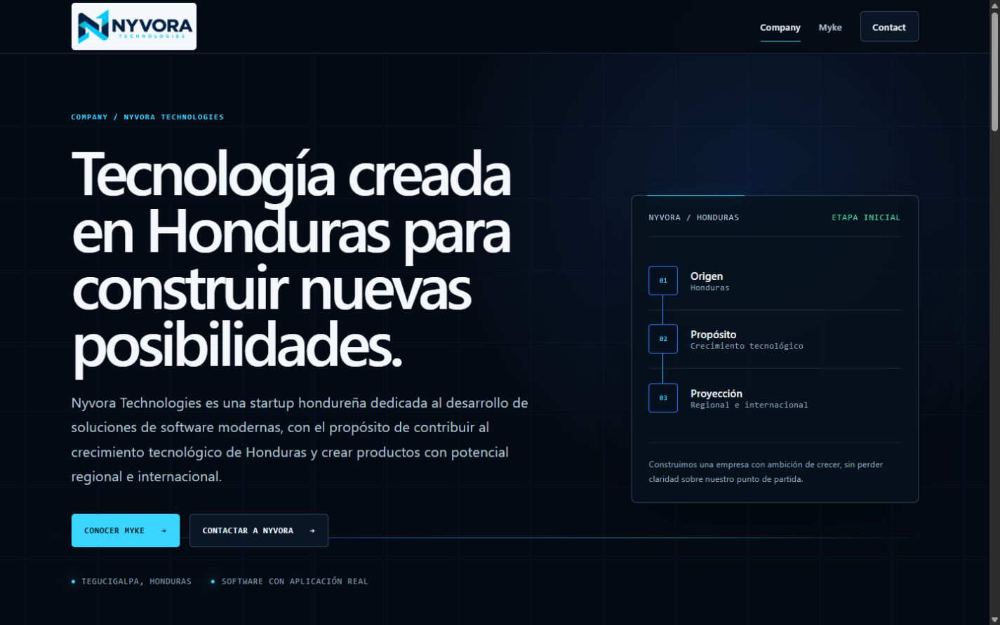

# Nyvora Technologies corporate website

[Nyvora Technologies](https://nyvoratechnologies.com) is the official corporate website for a Honduran technology startup focused on building modern, useful and scalable software. This repository contains only the public website; it is separate from Nyvora Myke's private application code, runtime and technical documentation.

**Production:** [https://nyvoratechnologies.com](https://nyvoratechnologies.com)



## About Nyvora Technologies

Nyvora Technologies was created in Honduras to contribute to the country's technological growth and turn complex ideas into clear, practical products. The company is at an early stage and has regional and international ambitions without claiming customers, certifications, partnerships or operating scale that have not been publicly verified.

## About Nyvora Myke

Nyvora Myke is the company's principal product at this stage. It is a conversational banking platform for financial institutions: a person begins with a banking need expressed in everyday language, and the experience presents the information, services or next steps that the institution has chosen to enable. Myke complements an institution's existing digital experience; its specific capabilities depend on that institution's systems, policies and implementation scope.

This website explains Myke's public value proposition only. It does not contain Myke's private architecture, source code, security design or implementation details.

## Technology

- Next.js 16 with the App Router
- React 19
- TypeScript in strict mode
- CSS Modules and a small global design-token layer
- Resend for server-side contact delivery
- Vitest and Testing Library for component and route tests
- Playwright and axe-core for browser smoke and accessibility checks
- ESLint for static analysis
- Vercel as the production hosting platform

Public content routes are statically rendered where possible. Interactive JavaScript is limited mainly to the responsive navigation and contact form.

## Architecture

The website uses a deliberately small architecture:

```text
Visitor's browser
  ├─ Static corporate pages and metadata
  ├─ Responsive navigation
  └─ Contact form
        │  POST /api/contact
        ▼
Next.js server route on Vercel
  ├─ Revalidates and normalizes the request
  ├─ Applies request-size and anti-spam checks
  ├─ Selects a recipient from an internal allowlist
  └─ Calls Resend with server-only credentials
        │
        ▼
Approved Nyvora corporate mailbox
```

Most page components run on the server and produce HTML. `SiteHeader` and `ContactForm` are Client Components because they require browser state and interaction. The contact API route and Resend integration run only on the server. There is no database, user authentication, analytics SDK or client-side email provider in this repository.

## Repository structure

```text
app/          App Router pages, metadata routes, error states and contact API
components/   Shared layout, navigation, form and presentation components
content/      Spanish-first public content prepared for future localization
lib/          Site constants, contact validation and server-side email delivery
public/       Official logo and social-sharing assets
tests/        Vitest and Testing Library coverage
e2e/          Playwright browser and accessibility smoke coverage
scripts/      Cross-platform orchestration for the production E2E server
docs/images/  Portfolio screenshots used by this README
```

The legal pages are website-specific drafts. They are not product agreements for Myke.

## Contact workflow

1. The browser collects the visitor's name, organization, email, subject, category, message and privacy consent.
2. Shared validation gives immediate feedback in the browser.
3. The browser sends JSON to `POST /api/contact`; it never supplies the final destination mailbox.
4. The server checks the content type, origin, body size, field limits, allowed category, control characters and simple anti-spam signals, then validates the request again.
5. An internal mapping selects the appropriate Nyvora mailbox. Arbitrary recipients supplied by a browser are ignored.
6. The server creates the email and calls Resend. The validated visitor email is used only as `Reply-To`.
7. The browser reports success only after the server accepts delivery. On failure, it keeps the entered data available for another attempt.

The automated test suite mocks Resend and never sends a real email.

## Requirements

- Node.js 20.9 or newer
- npm, using the lockfile included in the repository
- A supported browser for local visual review
- Resend credentials only when testing real contact delivery

## Local installation

```bash
git clone https://github.com/Hazielpavon/Nyvora-Technologies-Corporate-Website.git
cd Nyvora-Technologies-Corporate-Website
npm ci
```

Create a local environment file from `.env.example`:

```bash
# macOS or Linux
cp .env.example .env.local

# Windows PowerShell
Copy-Item .env.example .env.local
```

Start the development server:

```bash
npm run dev
```

Open [http://localhost:3000](http://localhost:3000). Browsing the site and running mocked tests do not require a real Resend key. A real contact submission does.

## Environment variables

Only the variable names and safe placeholders belong in documentation or committed files:

```dotenv
RESEND_API_KEY=<server-only-resend-api-key>
RESEND_EMAIL_DOMAIN=<verified-sending-domain>
```

- `RESEND_API_KEY` authenticates the server with Resend. It must never use a `NEXT_PUBLIC_` prefix or be exposed to browser code.
- `RESEND_EMAIL_DOMAIN` is the verified domain used to construct the website sender address.

Use `.env.local` for local values and Vercel Environment Variables for previews or production. Never commit, paste into an issue or include a real value in screenshots, tests or logs.

## Commands

| Command | Purpose |
| --- | --- |
| `npm run dev` | Start the local Next.js development server. |
| `npm run lint` | Run ESLint with zero warnings allowed. |
| `npm run typecheck` | Generate current Next.js route types and run TypeScript without emitting files. |
| `npm test` | Run the Vitest suite once with Resend mocked. |
| `npm run test:watch` | Run Vitest in watch mode. |
| `npm run test:e2e` | Run Playwright browser, responsive and accessibility smoke checks. |
| `npm run build` | Create the optimized production build. |
| `npm run start` | Serve an existing production build locally. |
| `npm audit --omit=dev` | Audit production dependencies. |

The release-quality validation sequence is:

```bash
npm ci
npm run lint
npm run typecheck
npm test
npm run build
npm audit --omit=dev
npm run test:e2e
```

## End-to-end tests

Install the Playwright Chromium runtime once on a new machine:

```bash
npx playwright install chromium
```

Then run:

```bash
npm run build
npm run test:e2e
```

The E2E runner starts the local production build, checks important routes at mobile and desktop sizes, exercises navigation and client-side form validation, watches for critical console errors and runs automated accessibility checks. It closes the test server when the suite finishes and does not require or use a real Resend credential.

## Vercel preview deployment

The project uses the standard Next.js build and does not require a custom Vercel adapter.

1. Import the GitHub repository into Vercel or create a preview from a review branch.
2. Add `RESEND_API_KEY` and `RESEND_EMAIL_DOMAIN` to the **Preview** environment only when real delivery must be tested.
3. Keep the framework preset on Next.js and the build command on `npm run build`.
4. Create the preview deployment; do not point the production domain or modify DNS for this step.
5. Verify the main routes, headers, responsive navigation and form validation on the preview URL.
6. If authorized, perform the real Resend smoke test described under manual follow-up.
7. Promote a reviewed deployment separately. A push or preview does not authorize production promotion, domain changes or DNS changes.

Production domain, DNS, Vercel project settings and Resend domain verification are managed outside this repository.

## Security considerations

- Contact input is validated in the browser and treated as untrusted on the server.
- Request size and field lengths are bounded.
- Recipient addresses come from a closed server-side mapping rather than browser input.
- Resend credentials remain in the server environment and are not bundled into client JavaScript.
- The visitor's validated email is used as `Reply-To`, not interpolated into a sender address.
- Provider failures receive generic public responses; message bodies and complete visitor emails are not intentionally logged.
- The endpoint uses simple honeypot and timing checks. These reduce basic automated abuse but are not a complete bot defense.
- Security headers include content-type protection, a restrictive referrer policy, permissions restrictions, framing protection and a production-oriented Content Security Policy.
- The contact response is not cached.

Origin checking is a supplementary signal, not authentication or a comprehensive anti-bot control. A durable distributed rate limit would require approved shared infrastructure; this repository intentionally does not pretend that in-memory serverless state provides one.

Please report suspected vulnerabilities according to [SECURITY.md](SECURITY.md).

## Technical status

The repository is designed to keep public pages static, isolate email credentials on the server, mock external delivery in automated tests, and make the primary quality checks reproducible from a clean installation. Metadata, canonical URLs, the favicon, social card, robots rules, sitemap, Spanish document language, responsive navigation, a skip link, visible focus states and reduced-motion support are maintained in source control.

Exact command results are recorded with the reviewed commit or release handoff rather than presented here as a permanent guarantee. Contributors must run the complete validation sequence above after every relevant change. Passing technical checks does not constitute legal approval, a security certification or evidence that an external email reached its destination.

## Limitations and manual follow-up

- **Legal review:** the Website Privacy Notice and Website Terms of Use remain drafts. They must retain their draft status, remain excluded from search indexing while pending and be reviewed by qualified counsel before they are treated as final. This repository makes no claim of legal approval.
- **Durable rate limiting:** the contact endpoint does not have a distributed rate limiter. Adding one requires an approved shared service and an operational decision; a local in-memory counter would be misleading on serverless infrastructure.
- **Real Resend smoke test:** automated tests use a mock. An authorized person must still verify one real preview submission, receipt in the selected mailbox, sender identity and `Reply-To` behavior without exposing credentials or personal data.
- **Commit metadata:** this public repository begins with a clean, reviewed snapshot. Future commits should continue using an approved corporate address or the owner's exact GitHub-provided `noreply` address.
- **External services:** live contact delivery depends on Vercel, Resend, DNS and monitored corporate mailboxes. Repository tests cannot prove their continuing availability or configuration.
- **Myke separation:** this repository intentionally cannot build, run or document the private Myke application.

### Testing one real Resend delivery safely

1. Use a Vercel preview, not the production domain.
2. Confirm that the preview holds `RESEND_API_KEY` and `RESEND_EMAIL_DOMAIN` as masked server-side values. Do not reveal or copy them into the browser.
3. Confirm in Resend that the intended sending domain is verified.
4. Submit one clearly labeled test message with non-sensitive example content and a mailbox controlled by the tester.
5. Select each destination category only when its Nyvora mailbox is actively monitored; do not send customer, financial or credential data.
6. Verify receipt, sender identity, subject, destination and `Reply-To` behavior in the corporate mailbox.
7. Review Vercel and Resend logs only for delivery status. Do not paste message content, addresses or secret values into an issue or report.
8. Remove preview-only credentials if the preview no longer needs live delivery.

## My role

I defined the website structure, content requirements, corporate and product positioning, contact workflow, validation criteria and deployment requirements. I used AI-assisted development tools during implementation and remained responsible for reviewing the code, testing behavior and accepting the final result. I do not claim to have written every line manually.

## Responsible use of AI-assisted development

AI-assisted tools helped with implementation, code review, test design and documentation. Their output was treated as a draft: requirements were supplied by the project owner, changes were reviewed against the public scope, automated checks were run, and final decisions remained the owner's responsibility. No private Myke source code or credentials should be supplied to these tools through this repository.

## License and ownership

Copyright © 2026 Nyvora Technologies. All rights reserved.

The source code is made publicly viewable for portfolio and transparency purposes. No permission to copy, modify, distribute or reuse Nyvora Technologies branding, content or source code is granted.

This notice describes the intended repository permissions and is not legal advice. No open-source license is granted.
